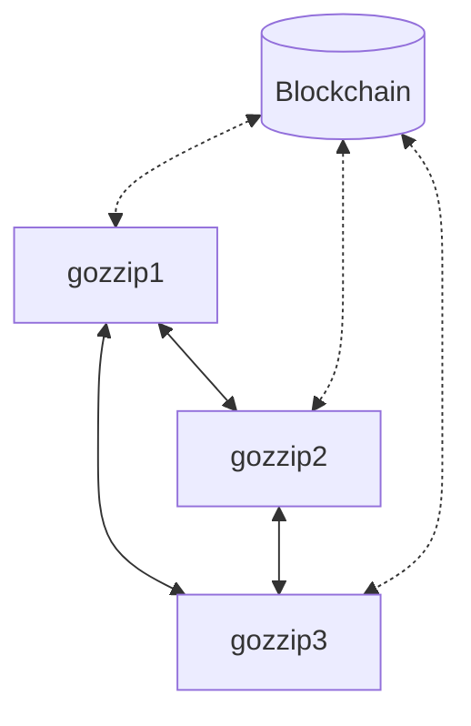
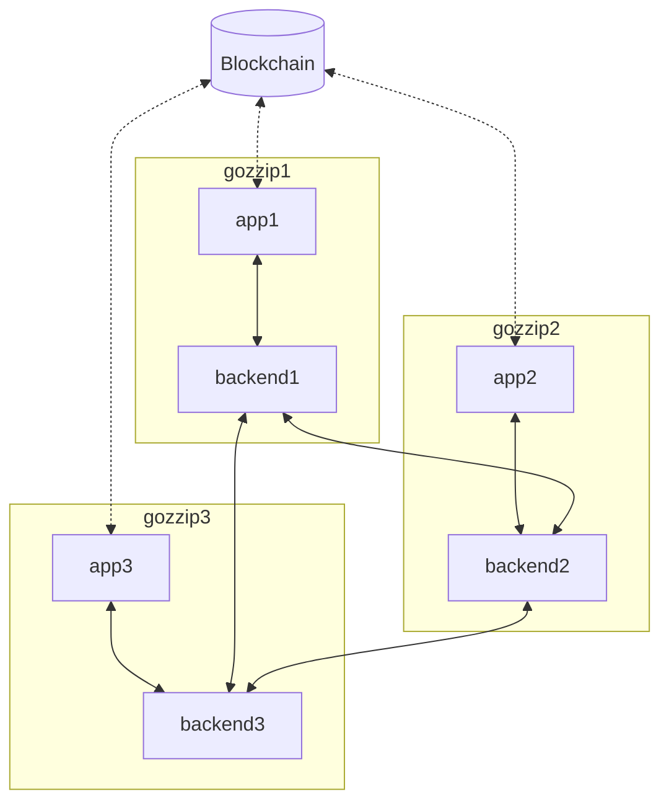
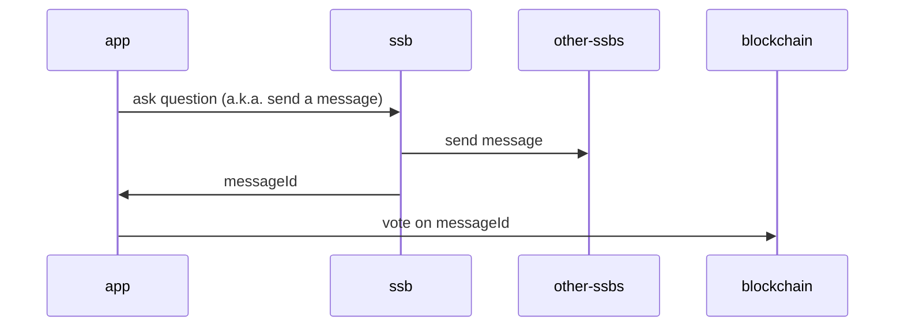

## running
```
docker compose up
```

# Architecture

## alt. 1

```mermaid
flowchart TB
    bc[(Blockchain)]
    bc <-.-> gozzip1
    bc <-.-> gozzip2
    bc <-.-> gozzip3
    gozzip1 <--> gozzip3
    gozzip1 <--> gozzip2
    gozzip2 <--> gozzip3
```

## alt.2

```mermaid
flowchart TB
    bc[(Blockchain)]
    bc <-.-> app1
    subgraph gozzip1
      app1 <--> backend1
    end
    bc <-.-> app2
    subgraph gozzip2
      app2 <--> backend2
    end
    bc <-.-> app3
    subgraph gozzip3
      app3 <--> backend3
    end
    backend1 <--> backend2
    backend1 <--> backend3
    backend2 <--> backend3
```

# voting

```mermaid
sequenceDiagram
    app->>ssb: ask question (a.k.a. send a message)
    ssb->>other-ssbs: send message
    ssb->>app: messageId
    app->>blockchain: vote on messageId
```