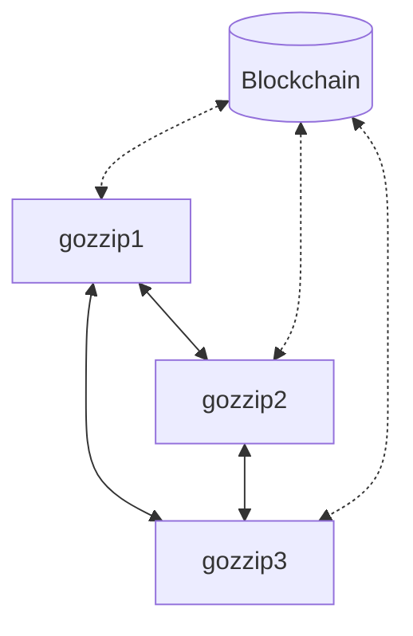
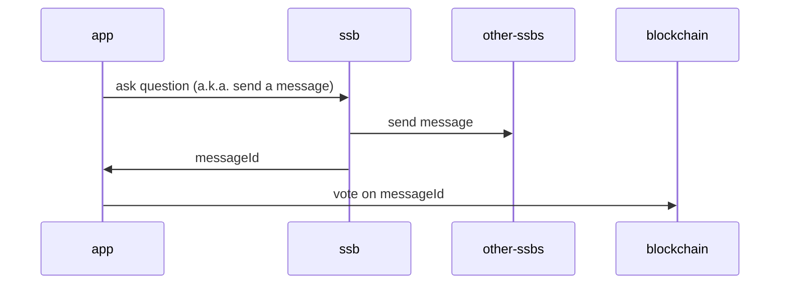

## running
```
docker compose up
```

# Architecture

```mermaid
flowchart TB
    bc[(Blockchain)]
    bc <-.-> gozzip1
    bc <-.-> gozzip2
    bc <-.-> gozzip3
    gozzip1 <--> gozzip3
    gozzip1 <--> gozzip2
    gozzip2 <--> gozzip3
```

# voting

```mermaid
sequenceDiagram
    app->>ssb: ask question (a.k.a. send a message)
    ssb->>other-ssbs: send message
    ssb->>app: messageId
    app->>blockchain: vote on messageId
```
