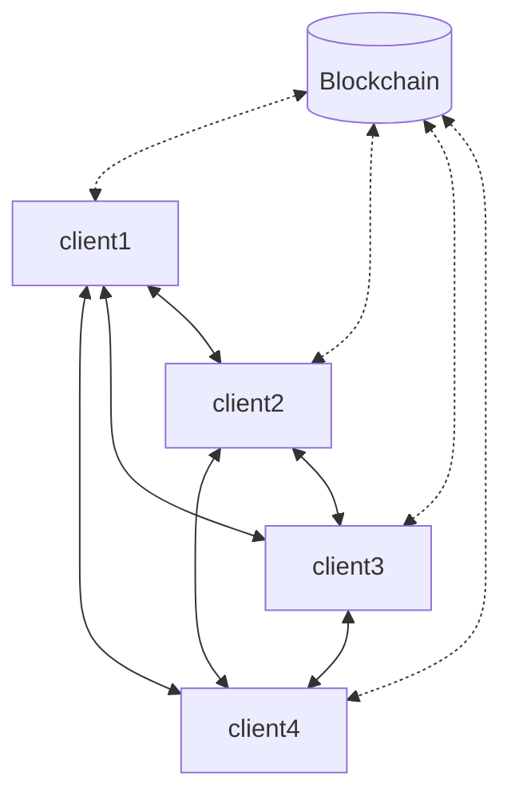
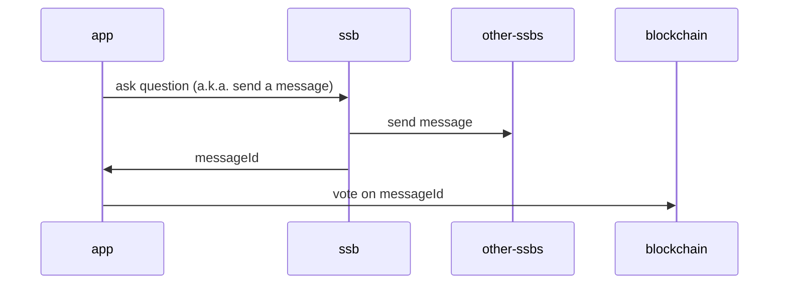

# start-up

npm run start-ssb
npm run start-node
cd contracts; npm run deploy

# Architecture

```mermaid
flowchart TB
    bc[(Blockchain)]
    bc <-.-> client1
    bc <-.-> client2
    bc <-.-> client3
    bc <-.-> client4
    client1 & client2 & client3 <--> client4
    client1 & client2 <--> client3
    client1 <--> client2
```

# voting

```mermaid
sequenceDiagram
    app->>ssb: ask question (a.k.a. send a message)
    ssb->>other-ssbs: send message
    ssb->>app: messageId
    app->>blockchain: vote on messageId
```
