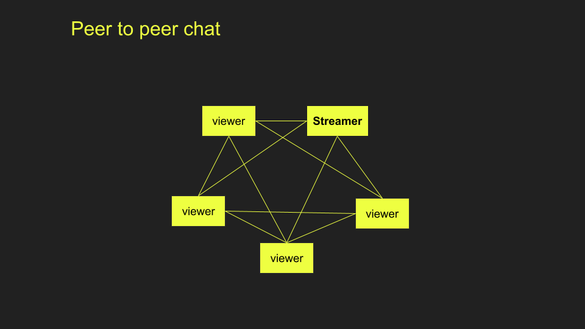
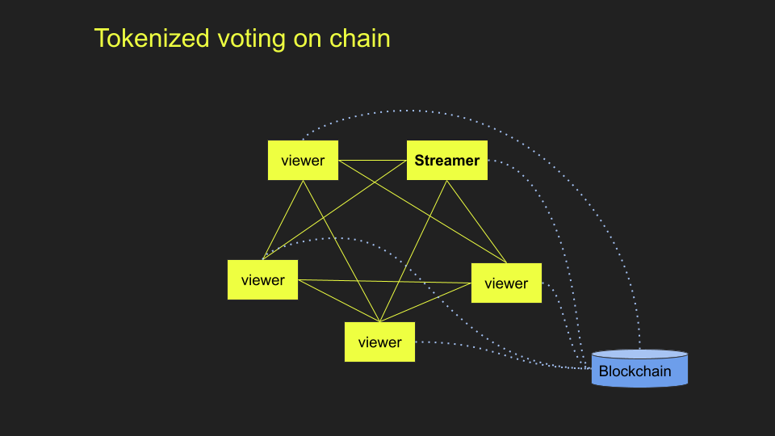
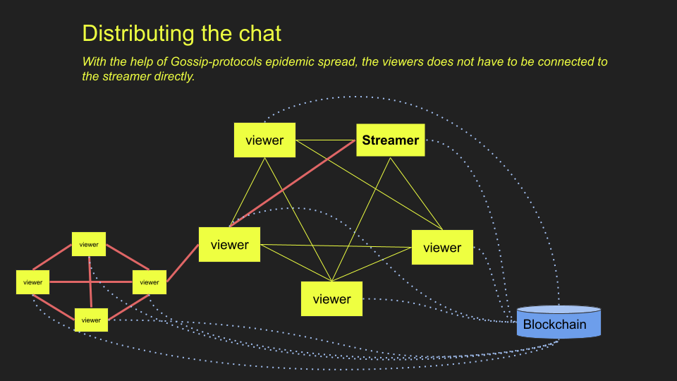

# Gozzip: Decentralized chat and tokenized 'moderation'

## Why?

Streamers often use the chat to interact with their viewers. This is often done with the help of a centralized platform. But this can both be problematic for user privacy and risk of being censored. With the use of a decentralized chat these risks can be avoided.
However, when using a decentralized chat other problems are introduced. One issue is that it is harder to prevent spam, and therefore also harder for the streamer to find questions from the viewers.

## What?

To solve this issue we are combining decentralized chat with tokenized questions and voting. Each viewer gets a set of tokens for a specific streamer session. Then, during the session, users can use their tokens to upvote valueble content such as comments and questions. With the introduction of these mechanisms the viewers and streamer can more easily identify high value content in the chat. Or have a completely filtered view of only the high value content.

## How?

The viewer uses the client to connect with the chat* to send messages. When the viewer want to ask a question, they can use their *limited\* set of tokens to flag a `messageId` as a question on chaim. Or, if they like, they can use their tokens to add weight to questions, i.e. upvoting, posed by other viewers. The streamer will then have a better understanding of what the viewers are interested in.

\* [Gossip-protocol](https://en.wikipedia.org/wiki/Gossip_protocol) implementation called [Secure Scuttlebutt (ssb)](https://github.com/ssbc/ssb-server). But any other chat-protocol could be used.

## Possible extensions

- Enabling the streamer to flag questions as answered.
  - Rewarding posing questions that is being answered with that user getting more tokens.
  - Giving back tokens used for upvoting when.
- The voting could be extended with ZK to only show the results for the streamer which would add some freedom to the streamer for selecting questions that are not toprated.

# running the project

installing
```
npm i
npm run build
cd ../app; npm i; npm run build;
```
start ssb:
```
npm run start-ssb
```
start hardhat node
```
npm run start-node
cd contracts; npm run deploy
```
start frontend
```
cd app; npm start
```

# Architecture





## Mermaid-diagrams


